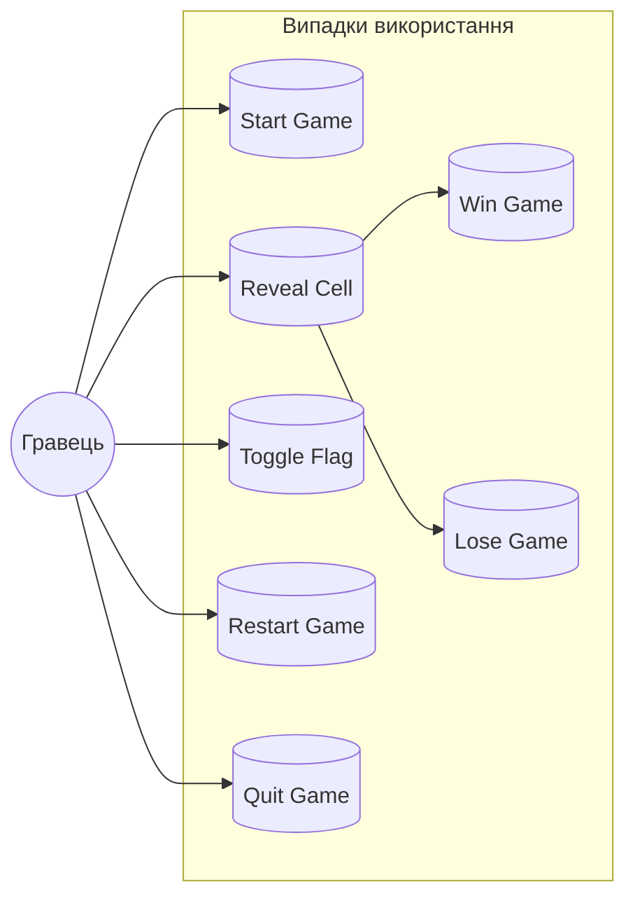
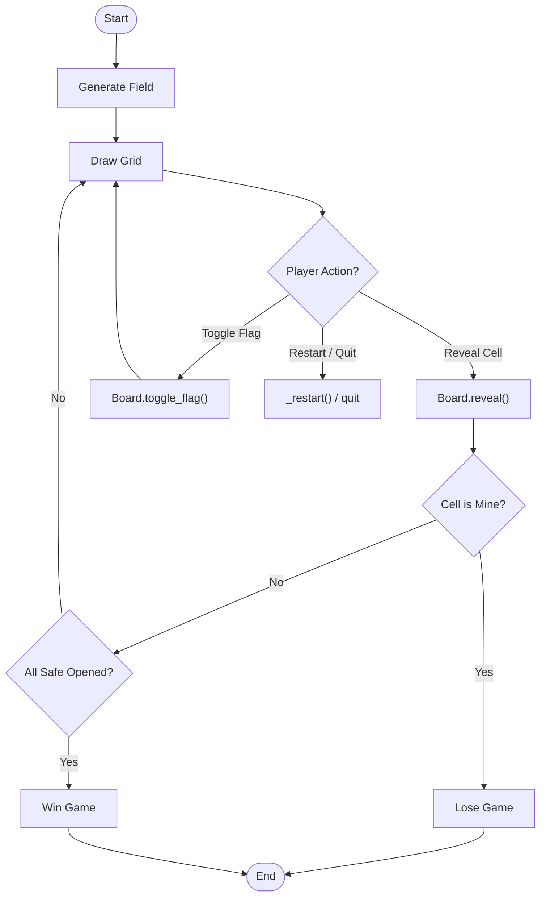
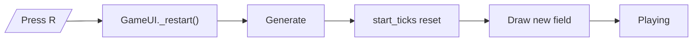
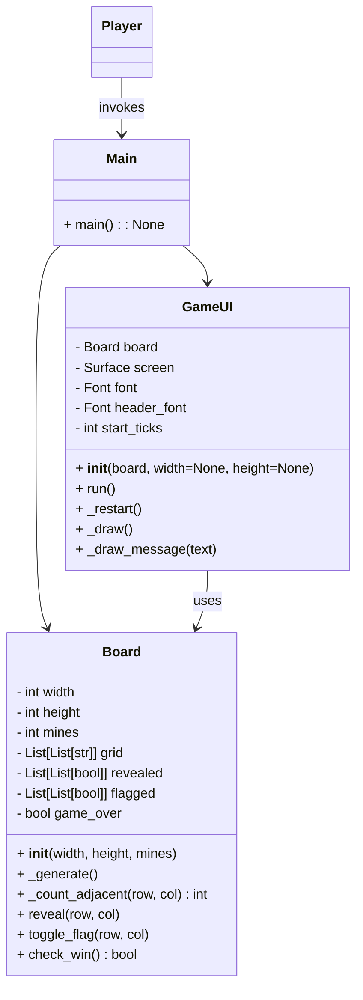

# План проекту

## Аналіз обраної гри та діаграма випадків використання

**Актор:**
- **Гравець** — користувач, що взаємодіє з грою через GUI.

**Випадки використання (Use Cases):**

| Випадок         | Опис                                                                 |
|-----------------|----------------------------------------------------------------------|
| **Start Game**  | Почати нову гру: генерується поле, обнуляються таймер і лічильник мін. |
| **Reveal Cell** | Відкрити клітинку: якщо це міна — поразка; якщо цифра — показати число; якщо порожня — рекурсивне відкриття сусідів. |
| **Toggle Flag** | Поставити або зняти прапорець на вибраній клітинці (для позначення мін). |
| **Restart Game**| Перезапустити гру з тими ж налаштуваннями складності (натиск R). |
| **Quit Game**   | Вийти з гри (натиск Q) та закрити вікно. |
| **Win Game**    | Виграти гру: всі безпечні клітинки відкриті. |
| **Lose Game**   | Програти гру: гравець відкрив клітинку з міною. |

## Проєктування гри: діаграми діяльності та класів

### Діаграма діяльності: основний цикл гри

### Діаграма діяльності: сценарій перезапуску

### Діаграма класів

